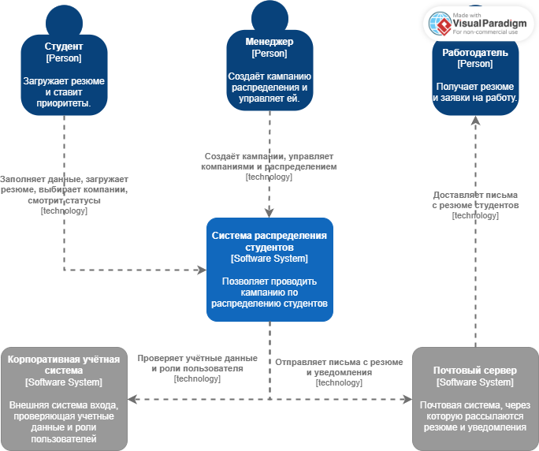

# Лабораторная работа №2  
**Тема:** Использование нотации C4 model для проектирования архитектуры программной системы  
**Цель работы:** Получить опыт использования графической нотации для фиксации архитектурных решений.  
## Диаграмма системного контекста
### Акторы (Person):
1. Студент (Person)
    - Заполняет профиль и загружает резюме (PDF).
    - Выбирает 3 приоритетные компании.
    - Смотрит статус своей заявки и итог распределения.
2. Менеджер практики (Person)
    - Создаёт кампании распределения по годам.
    - Добавляет/редактирует компании и их вместимость.
    - Просматривает и скачивает резюме студентов.
    - Управляет приоритетами и статусами, формирует результаты распределения.
3. Работодатель (Person)
    - Не взаимодействует с системой напрямую.
    - Получает письма с резюме от менеджера через почтовую систему.
    - Дальше общается с менеджером любыми внешними средствами (почта, тг).
### Внешние системы (Software System):
4. Почтовый сервер (External Software System)
    - Принимает письма от нашей системы и доставляет их работодателям.
5. Корпоративная учётная система
    - Может использоваться для аутентификации студентов/менеджеров (потенциально, если будет время)

